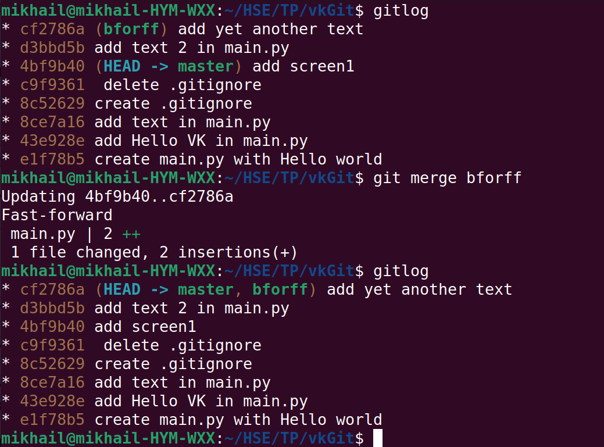
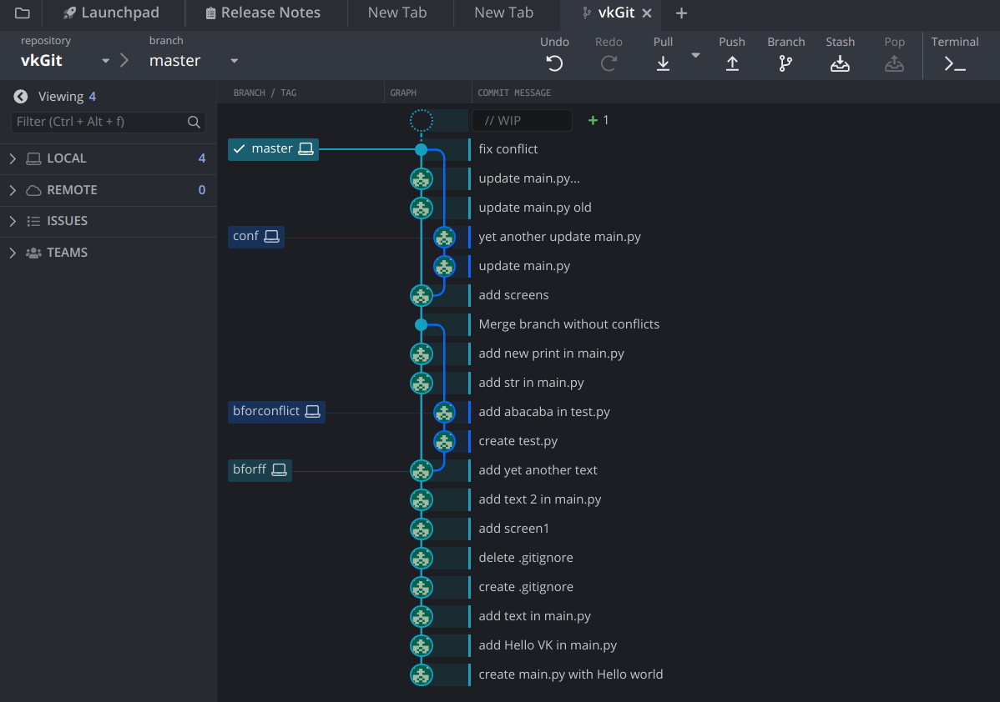

## Screenshots

# Part I. Init git repo
Git init and some commits\

# Part II. Fast-forward merge
Before fast formard (kraken)

Fast forward (terminal)

Fast forward (kraken)

# Part III. Merge commit (no conflict)
Terminal

Kraken

# Part IV. Merge conflict
Terminal

Kraken
